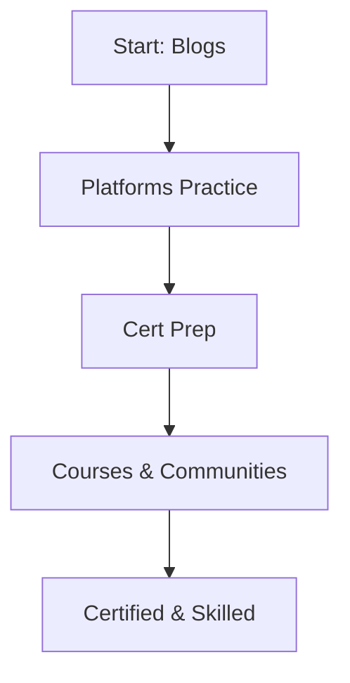

## Overview

Access a wealth of AI learning resources designed for beginners with zero technical barriers. Follow the slogan `{零技術門檻，AI技能輕鬆上手}` by exploring blogs, shared platforms, certifications, courses, and progress tracking tools. These resources help you build practical AI skills through self-paced learning and community support.

<Callout kind="tip">
  Start with blogs for quick insights, then move to platforms and certifications for hands-on practice.
</Callout>

## Self-Paced Learning with Blogs

Read articles on AI trends, tools, and applications without needing coding knowledge. Blogs provide bite-sized lessons on topics like prompt engineering and AI ethics.

Visit the [看文章學AI](https://aitw.biz/zh/page/blog) section to browse curated content. Key benefits include:

- Real-world examples from founders like Danny Chang and Chou Chang Han
- Free access for all members
- Regular updates on new AI tools

<Columns cols={2}>
  <Card title="Daily AI Tips" icon="book-open" href="https://aitw.biz/zh/page/blog">
    Short articles to build foundational knowledge.
  </Card>
  <Card title="Advanced Concepts" icon="trending-up" href="https://aitw.biz/zh/page/blog">
    Deeper dives into AI applications.
  </Card>
</Columns>

## Shared AI Platforms

Leverage collaborative platforms to experiment with AI without setup. Platforms like Premlogin and Flixseek offer pre-built tools and shared prompts.

<Tabs>
  <Tab title="Premlogin" icon="share-2">
    Access the [Premlogin AI共享平台](https://aitw.biz/zh/page/Premlogin-Sharing-AI).
    
    Use it for:
    - Shared GPTs and custom bots
    - Community prompts for business and education
    
    <CodeGroup tabs="Prompt Example">
    ````javascript
    // Example prompt for business analysis
    "Analyze this sales data: [paste data]. Suggest improvements."
    ````
    ````python
    # Python-like prompt structure
    "Generate a marketing plan using: target=audiences, budget=5000"
    ````
    </CodeGroup>
  </Tab>
  <Tab title="Flixseek" icon="film">
    Explore the [Flixseek AI共享平台](https://aitw.biz/zh/page/Flixseek-Sharing-AI).
    
    Ideal for:
    - Video analysis and content generation
    - Creative AI workflows
    
    Start by logging in and browsing shared resources.
  </Tab>
</Tabs>

## Preparing for AI Certifications

Earn credentials to validate your skills. Certifications cover practical AI use cases.

<Steps>
  <Step title="Review Syllabus" icon="book">
    Check available [證照、考題](https://aitw.biz/zh/page/Certificate).
  </Step>
  <Step title="Practice Exams" icon="check-circle">
    Take mock tests and review answers.
  </Step>
  <Step title="Study Resources" icon="graduation-cap">
    Combine blogs and platforms for preparation.
  </Step>
  <Step title="Apply and Certify" icon="award">
    Submit for official certification.
  </Step>
</Steps>

| Certification | Focus Area | Difficulty |
|---------------|------------|------------|
| AI Basics     | Fundamentals | Beginner  |
| Prompt Engineering | Tool Usage | Intermediate |
| Business AI  | Applications | Advanced |

## AI Learning Courses and Communities

Join structured courses and member plans for guided learning.

<ExpandableGroup>
  <Expandable title="Free Member Plan" default-open="true">
    Access basic courses and blogs via [免費會員計畫](https://aitw.biz/zh/page/free-member).
  </Expandable>
  <Expandable title="Elite Member Plan">
    Unlock advanced [菁英會員計畫](https://aitw.biz/zh/page/elite-member) with live sessions.
  </Expandable>
  <Expandable title="AI Teacher Plan">
    For educators: [AI菁英教育者計畫](https://aitw.biz/zh/page/ai-teacher).
  </Expandable>
</ExpandableGroup>

Explore [AI學習課程](https://aitw.biz/zh/page/Learning) and past records at [過往課程紀錄](https://aitw.biz/zh/page/passclass).

## Tracking Learning Milestones

Monitor progress with simple checklists.



Set milestones like "Complete 10 blog posts" or "Earn first certification." Use member dashboards to track.

<Callout kind="success">
  Consistent practice leads to mastery—aim for one milestone per week.
</Callout>